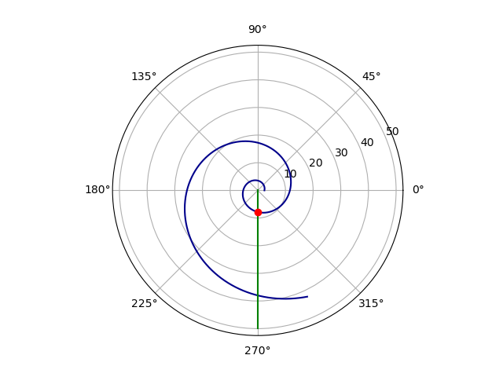
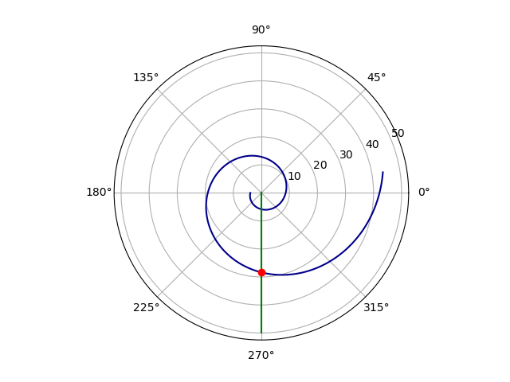

---
## Front matter
lang: ru-RU
title: " Лабораторной работе №2. Задача о погоне "
author: |
	 "Евдокимов Максим Михайлович НФИбд-01-20"\inst{1}

institute: |
	\inst{1}Российский Университет Дружбы Народов

date: 17 февраля, 2023, Москва, Россия

## Formatting
mainfont: PT Serif
romanfont: PT Serif
sansfont: PT Sans
monofont: PT Mono
toc: false
slide_level: 2
theme: metropolis
header-includes: 
 - \metroset{progressbar=frametitle,sectionpage=progressbar,numbering=fraction}
 - '\makeatletter'
 - '\beamer@ignorenonframefalse'
 - '\makeatother'
aspectratio: 43
section-titles: true

---

# Цели и задачи работы

## Цель работы

Цель работы - разобраться в алгоритме построения математической модели на примере задачи о погоне. Нам необходимо провести теоритические рассуждение и вывести дифференциальные уравнения, с помощью которых мы сможем определить точку пересечения лодки и катера из задачи.
Для более наглядного примера нам были выданы варианты, с помощью которых можно будет смоделировать траектории движения лодки и катера.
Условия задачи: "На море в тумане катер береговой охраны преследует лодку браконьеров. Через определенный промежуток времени туман рассеивается, и лодка обнаруживается на расстоянии k км от катера. Затем лодка снова скрывается в тумане и уходит прямолинейно в неизвестном направлении. Известно, что скорость катера в n раза больше скорости браконьерской лодки.
Необходимо определить по какой траектории необходимо двигаться катеру, чтоб нагнать лодку."

# Задача

1. Изучить условия задачи. Провести теоритические рассуждения используя данные из варианта
2. Вывести дифференциальное уравнение, соответствующее условиям задачи
3. Написать программу для расчета траетории движения катера и лодки.
4. Построить модели.
5. Определить по моделям точку пересечения катера и лодки.

# Ход работы лабораторной работы

## Теоретический материал 1

Принимаем за $t_0=0, X_0=0$  - место нахождения лодки браконьеров в момент, когда их обнаруживают катера береговой охраны. После введем полярные координаты.
Время, за которое они пройдут это расстояние, вычисляется как $\frac{x}{υ}$ или $\frac{x+k}{υ}$ (для второго случая $\frac{x-k}{υ}$).  Так как время одно и то же, то эти величины одинаковы.
Тогда неизвестное расстояние можно найти из следующего уравнения:  $\frac{x}{υ} = \frac{x+k}{υ}$ - в первом случае, $\frac{x}{υ} =  \frac{x-k}{υ}$ во втором случае.

## Теоретический материал 2

Отсюда мы найдем два значения $x_1$ и $x_2$, задачу будем решать для двух случаев :

*$x_1=\frac{k}{n+1}$ ,при $\theta=0$

*$x_2=\frac{k}{n-1}$ ,при $\theta=-\pi$

## Теоретический материал 3

Найдем тангенциальную скорость для нашей задачи $υ_t=r\frac{d\theta}{dt}$.
Вектора образуют прямоугольный треугольник, откуда по теореме Пифагора можно найти тангенциальную скорость $υ_t= \sqrt{n^2 υ_r^2-v^2}$. Поскольку, радиальная скорость равна $υ$, то тангенциальную скорость находим из уравнения $υ_t= \sqrt{n^2 υ^2-υ^2 }$. Следовательно, $υ_τ=υ\sqrt{n^2-1}$.

* Тогда получаем $r\frac{d\theta}{dt}=υ\sqrt{n^2-1}$

## Формулы

## Теоретический материал

Исключая из полученной системы производную по t, можно перейти к следующему уравнению: $\frac{dr}{d\theta}=\frac{r}{\sqrt{n^2-1}}$
Начальные условия остаются прежними. Решив это уравнение, мы получим траекторию движения катера в полярных координатах.

## Условие задачи

На море в тумане катер береговой охраны преследует лодку браконьеров.
Через определенный промежуток времени туман рассеивается, и лодка обнаруживается на расстоянии 19 км от катера.
Затем лодка снова скрывается в тумане и уходит прямолинейно в неизвестном направлении.
Известно, что скорость катера в 5.1 раза больше скорости браконьерской лодки

## Результаты работы программы

Точка пересечения красного и зеленого графиков является точкой пересечения катера береговой охраны и лодки браконьеров. Исходя из этого графика, мы имеем координаты:
Координаты точки пересечения - (4.71238898038469 ; 7.823758233349156)

## Результаты работы программы

Точка пересечения красного и зеленого графиков является точкой пересечения катера береговой охраны и лодки браконьеров. Исходя из этого графика, мы имеем координаты:
Координаты точки пересечения - (4.71238898038469 ; 28.363483870979746)

# Выводы

Мы рассмотрели задачу о погоне, также провели анализ с помощью данных которые нам были даны, составили и решили дифференциальные уравнения. Смоделировали ситуацию и сделали вывод, что в первом случае погоня завершиться раньше.
