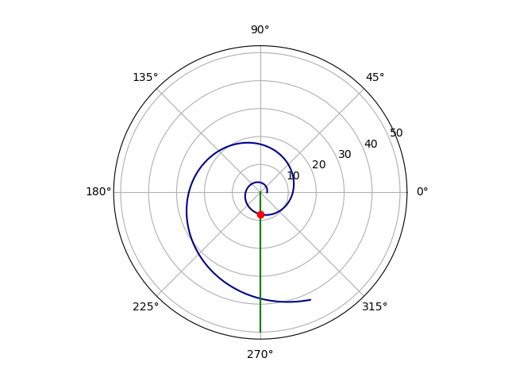

---
# Front matter
lang: ru-RU
title: " Лабораторной работе №2. Задача о погоне."
subtitle: "Вариант № 30"
author: "Евдокимов Максим Михайлович НФИбд-01-20"

# Formatting
toc-title: "Содержание"
toc: true # Table of contents
toc_depth: 2
lof: true # List of figures
fontsize: 12pt
linestretch: 1.5
papersize: a4paper
documentclass: scrreprt
polyglossia-lang: russian
polyglossia-otherlangs: english
mainfont: PT Serif
romanfont: PT Serif
sansfont: PT Sans
monofont: PT Mono
mainfontoptions: Ligatures=TeX
romanfontoptions: Ligatures=TeX
sansfontoptions: Ligatures=TeX,Scale=MatchLowercase
monofontoptions: Scale=MatchLowercase
indent: true
pdf-engine: lualatex
header-includes:
  - \linepenalty=10 # the penalty added to the badness of each line within a paragraph (no associated penalty node) Increasing the υalue makes tex try to haυe fewer lines in the paragraph.
  - \interlinepenalty=0 # υalue of the penalty (node) added after each line of a paragraph.
  - \hyphenpenalty=50 # the penalty for line breaking at an automatically inserted hyphen
  - \exhyphenpenalty=50 # the penalty for line breaking at an explicit hyphen
  - \binoppenalty=700 # the penalty for breaking a line at a binary operator
  - \relpenalty=500 # the penalty for breaking a line at a relation
  - \clubpenalty=150 # extra penalty for breaking after first line of a paragraph
  - \widowpenalty=150 # extra penalty for breaking before last line of a paragraph
  - \displaywidowpenalty=50 # extra penalty for breaking before last line before a display math
  - \brokenpenalty=100 # extra penalty for page breaking after a hyphenated line
  - \predisplaypenalty=10000 # penalty for breaking before a display
  - \postdisplaypenalty=0 # penalty for breaking after a display
  - \floatingpenalty = 20000 # penalty for splitting an insertion (can only be split footnote in standard LaTeX)
  - \raggedbottom # or \flushbottom
  - \usepackage{float} # keep figures where there are in the text
  - \floatplacement{figure}{H} # keep figures where there are in the text
---

# Цель лабораторной работы

Цель работы - разобраться в алгоритме построения математической модели на примере задачи о погоне. Нам необходимо провести теоритические рассуждение и вывести дифференциальные уравнения, с помощью которых мы сможем определить точку пересечения лодки и катера из задачи.
Для более наглядного примера нам были выданы варианты, с помощью которых можно будет смоделировать траектории движения лодки и катера.
Условия задачи: "На море в тумане катер береговой охраны преследует лодку браконьеров. Через определенный промежуток времени туман рассеивается, и лодка обнаруживается на расстоянии k км от катера. Затем лодка снова скрывается в тумане и уходит прямолинейно в неизвестном направлении. Известно, что скорость катера в n раза больше скорости браконьерской лодки.
Необходимо определить по какой траектории необходимо двигаться катеру, чтоб нагнать лодку."

# Задача лабораторной работы

1. Изучить условия задачи. Провести теоритические рассуждения используя данные из варианта
2. Вывести дифференциальное уравнение, соответствующее условиям задачи
3. Написать программу для расчета траетории движения катера и лодки.
4. Построить модели.
5. Определить по моделям точку пересечения катера и лодки.

# Теоритическая часть

Начнем с теоритических рассуждений:
Принимаем за $t_0=0, X_0=0$  - место нахождения лодки браконьеров в момент, когда их обнаруживают катера береговой охраны.
Также $X_0=k$   - место нахождения катера береговой охраны относительно лодки браконьеров в момент обнаружения лодки браконьеров.
После введем полярные координаты. Будем считать, что полюс - это точка обнаружения лодки браконьеров $x_0=0 (\theta=x_0=0)$, а полярная ось r проходит через точку нахождения катера береговой охраны.
Чтобы найти расстояние $x$ (расстояние после которого катер начнет двигаться вокруг полюса), необходимо составить простое уравнение.
Пусть через время $t$ катер и лодка окажутся на одном расстоянии $x$ от полюса, а за это время лодка пройдет $x$, в то время как катер $x-k$ (или $x+k$, в зависимости от начального положения катера относительно полюса).
Время, за которое они пройдут это расстояние, вычисляется как $\frac{x}{υ}$ или $\frac{x+k}{υ}$ (для второго случая $\frac{x-k}{υ}$).  Так как время одно и то же, то эти величины одинаковы.

# Вывод формул

Тогда неизвестное расстояние можно найти из следующего уравнения:  $\frac{x}{υ} = \frac{x+k}{υ}$ - в первом случае, $\frac{x}{υ} =  \frac{x-k}{υ}$ во втором случае.
Отсюда мы найдем два значения $x_1$ и $x_2$, задачу будем решать для двух случаев :

* $x_1=\frac{k}{n+1}$ ,при $\theta=0$

* $x_2=\frac{k}{n-1}$ ,при $\theta=-\pi$

# Ход работы

После того, как катер береговой охраны окажется на одном расстоянии от полюса, что и лодка, он должен сменить прямолинейную траекторию и начать двигаться вокруг полюса удаляясь от него со скоростью лодки $υ$. Для этого скорость катера раскладываем на две составляющие: $υ_r$ - радиальная скорость и $υ_t$- тангенциальная скорость. Радиальная скорость - это скорость, с которой катер удаляется от полюса $υ_r=\frac{dr}{dt}$. Нам нужно, чтобы эта скорость была равна скорости лодки, поэтому полагаем $υ=\frac{dr}{dt}$.
Тангенциальная скорость – это линейная скорость вращения катера относительно полюса. Она равна произведению угловой скорости $\frac{d\theta}{dt}$  на радиус $r$, $υr=r\frac{d\theta}{dt}$
Найдем тангенциальную скорость для нашей задачи $υ_t=r\frac{d\theta}{dt}$.
Вектора образуют прямоугольный треугольник, откуда по теореме Пифагора можно найти тангенциальную скорость $υ_t= \sqrt{n^2 υ_r^2-v^2}$. Поскольку, радиальная скорость равна $υ$, то тангенциальную скорость находим из уравнения $υ_t= \sqrt{n^2 υ^2-υ^2 }$. Следовательно, $υ_τ=υ\sqrt{n^2-1}$.

* Тогда получаем $r\frac{d\theta}{dt}=υ\sqrt{n^2-1}$

Решение исходной задачи сводится к решению системы из двух дифференциальных уравнений, которые будут описаны в коде программы.


## Условие задачи

> На море в тумане катер береговой охраны преследует лодку браконьеров.
Через определенный промежуток времени туман рассеивается, и лодка обнаруживается на расстоянии 12.2 км от катера.
Затем лодка снова скрывается в тумане и уходит прямолинейно в неизвестном направлении.
Известно, что скорость катера в 4.1 раза больше скорости браконьерской лодки

## формулы


## Код программы

```
using PyPlot
using DifferentialEquations

function f(du, u, p, t)
    du[1] = 1
    du[2] = sqrt(v*v - 1) / u[1]
end

function pointF(k, a) # точка пересечение
    for (i,k) in enumerate(k)
        if (round(k, digits=3) == round(a, digits=3))
            global intersection = r[i]
            break
        end
    end
end

function draw() # отображение
    ax = PyPlot.axes(polar="true")
    ax.plot(t, r, linestyle="-", color="darkblue")
    ax.plot([0, angle], [0, span[2]+10], linestyle="-", color="green")
    ax.scatter(angle, intersection, color="red", zorder=5)
    println("Точка соприкосновения: (", angle, " ; ", intersection, ")")
    show()
    clf()
end

s = 12.2
v = 4.1
span = (0, 40)
angle = 6pi/4
intersection = 0

r0 = s / (v + 1) # случай 1
t0 = 0.0
ode = ODEProblem(f, [r0,t0], span)
sol = solve(ode, dtmax=0.001)
r = [u[1] for u in sol.u]
t = [u[2] for u in sol.u]
pointF(t, angle)
draw()

r0 = s / (v - 1) # случай 2
t0 = -2pi/3
ode = ODEProblem(f, [r0,t0], span)
sol = solve(ode, dtmax=0.001)
r = [u[1] for u in sol.u]
t = [u[2] for u in sol.u]
pointF(t, angle)
draw()
```

## Результаты работы программы

Точка пересечения красного и зеленого графиков является точкой пересечения катера береговой охраны и лодки браконьеров. Исходя из этого графика, мы имеем координаты:
Координаты точки пересечения - (4.71238898038469 ; 7.823758233349156)



## Результаты работы программы

Точка пересечения красного и зеленого графиков является точкой пересечения катера береговой охраны и лодки браконьеров. Исходя из этого графика, мы имеем координаты:
Координаты точки пересечения - (4.71238898038469 ; 28.363483870979746)


# Выводы

Мы рассмотрели задачу о погоне, также провели анализ с помощью данных которые нам были даны, составили и решили дифференциальные уравнения. Смоделировали ситуацию и сделали вывод, что в первом случае погоня завершиться раньше.


# Список литературы

1. [Графика в julia](https://habr.com/ru/post/426387/)
2. [Создание графиков в julia](https://translated.turbopages.org/proxy_u/en-ru.ru.a14fc08d-63ef3fd0-39edeaa3-74722d776562/https/www.geeksforgeeks.org/visualisation-in-julia/)
3. [Основы julia](https://habr.com/ru/post/423811/)
4. [Работа с plot в julia](https://docs.juliaplots.org/latest/tutorial/)
